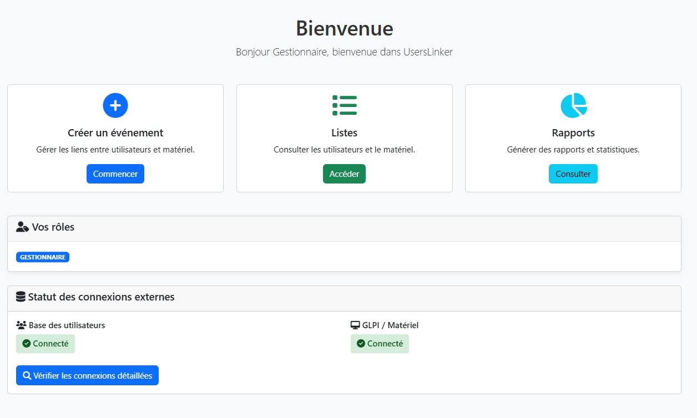

# userslinker


Un petit geste, un grand soutien ! Offrez-moi un café ☕ si vous appréciez mon travail. Merci d’avance !

[](https://www.buymeacoffee.com/yann83)

[English version here](README_eng.md)

## A propos

Cette application gére les mouvements de matériels prêtés à vos salariés, afin de garder une trace des entrées sorties. L'application est simple d'utilisation et trois rôles servent à compartimenter les résponsabilités de chacun. Très utile pour si vous avez des télétravailleurs dans votre entreprise, vous aurez accès aux listes et rapports des mouvements de vos biens.

## Installation

> git clone https://github.com/yann83/MapProject.git


Dans le dossier `setup` mettez à jour ces valeurs

```
MYSQL_HOST=localhost
MYSQL_USER=root
MYSQL_PASSWORD=your_password_here
MYSQL_DB=bd_userslinker
``` 

Puis lancez

> python setup.py

## Comment utiliser l'application

Je conseille de bien séparer les rôles, un administrateur ne doit pas être un gestionnaire. 

### Rôle administrateur


Les administrateurs peuvent :

 - Créer, modifier et supprimer des utilisateurs pour les accès à l'application
 - Importer des données d'autres bases de données
 

 
Pour se connecter à un autre base de données il faut renseigner un fichier `bdd.json` dans le dossier `config`

Voici un exemple :

```json
{
"users":{
	"connect":{
		"host":"localhost",
		"user":"root",
		"password":"",
		"db":"users",
		"table":"all_users"
		},
	"fields":{
		"GivenName":"givenName",
		"Surname":"surname",
		"Username":"login",
		"email":"mail",
		"Title":"title",
		"Department":"service",
		"Site":"location"
		}
	},
"computers":{
	"connect":{
		"host":"localhost",
		"user":"root",
		"password":"",
		"db":"glpi",
		"table":"glpi_computers"
		},
	"fields":{
		"name":"name",
		"serial":"serial",
		"otherserial":"otherserial"
		}
	},
"monitors":{
	"connect":{
		"host":"localhost",
		"user":"root",
		"password":"",
		"db":"glpi",
		"table":"glpi_monitors"
		},
	"fields":{
		"name":"name",
		"serial":"serial",
		"otherserial":"otherserial"
		}
	},
"peripherals":{
	"connect":{
		"host":"localhost",
		"user":"root",
		"password":"",
		"db":"glpi",
		"table":"glpi_peripherals"
		},
	"fields":{
		"name":"name",
		"serial":"serial",
		"otherserial":"otherserial"
		}
	},
"phones":{
	"connect":{
		"host":"localhost",
		"user":"root",
		"password":"",
		"db":"glpi",
		"table":"glpi_phones"
		},
	"fields":{
		"name":"name",
		"serial":"serial",
		"otherserial":"otherserial"
		}
	}	
}
```

Vous pouvez créer un post process de l'import en créant des requêtes sql dans le fichier `post.sql` dans le dossier `config`, par exemple :

```sql
DELETE FROM bd_userslinker.phones
WHERE (name IS NULL OR name = '')
  OR (otherserial IS NULL OR otherserial = '');
```

### Rôle gestionnaire



Le manager peux accèder aux fonctions :

 - Créer un événement : gérer les liens entre utilisateurs et matériel
 - Listes : consulter les utilisateurs et le matériel.
 - Rapports : générer des rapports et statistiques.
 
__Créer un évenement__ 


C'est la la fonction la plus importante, il faut suivre les étapes pour attributer (lié) ou récupérer (délié) des matériels pour un utilisateur donné.

__Listes__


Permet de visualiser le parc des matériels et permet de créer, éditer ou supprimer des objets

__Rapports__


 1. Rapport par service : génère un rapport détaillé des utilisateurs et de leur matériel par service.

 - Filtrage par service (obligatoire)
 - Filtrage par période (optionnel)
 - Affichage du matériel lié
 - Historique des mouvements

 2. Rapport par utilisateur : génère un rapport détaillé pour un utilisateur spécifique.

 - Recherche dynamique d'utilisateur
 - Historique complet (toutes dates)
 - Matériel actuellement lié
 - Statistiques détaillées
 
 3. Rapport par type de matériel : analyse de la répartition et utilisation par type de matériel.


 - Graphiques en camembert
 - Statistiques détaillées
 - Taux d'utilisation
 - Répartition par service
 
 4. Rapport d'activité : analyse des mouvements et activités sur une période donnée.

 - Timeline des activités
 - Statistiques par gestionnaire
 - Graphiques de tendance
 - Export détaillé
 
### Rôle lecteur

Le lecteur peux accèder aux fonctions :

 - Listes : consulter les utilisateurs et le matériel.
 - Rapports : générer des rapports et statistiques.
 
Le lecteur n'a pas les droits d'édition sur les listes.