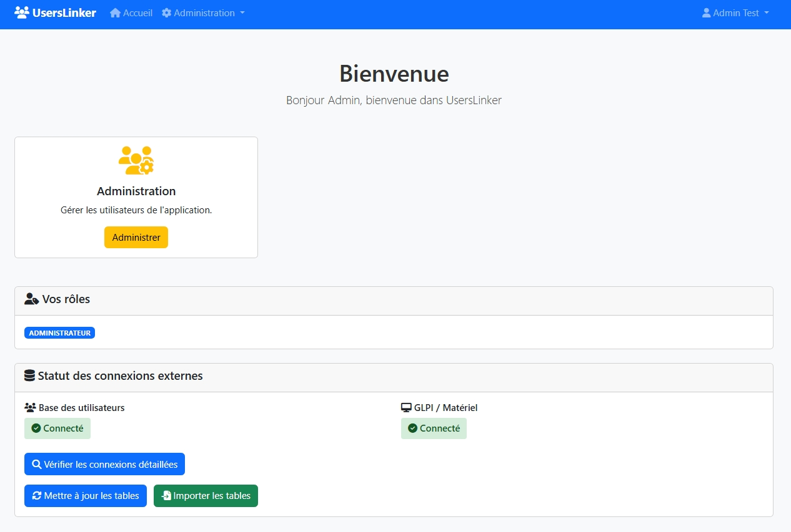
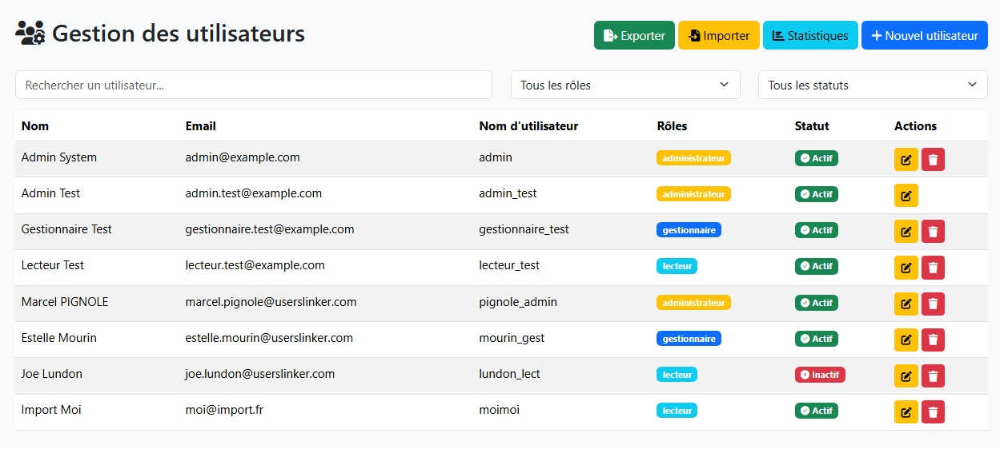
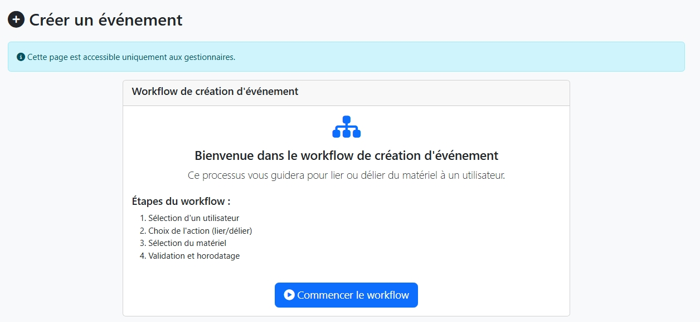
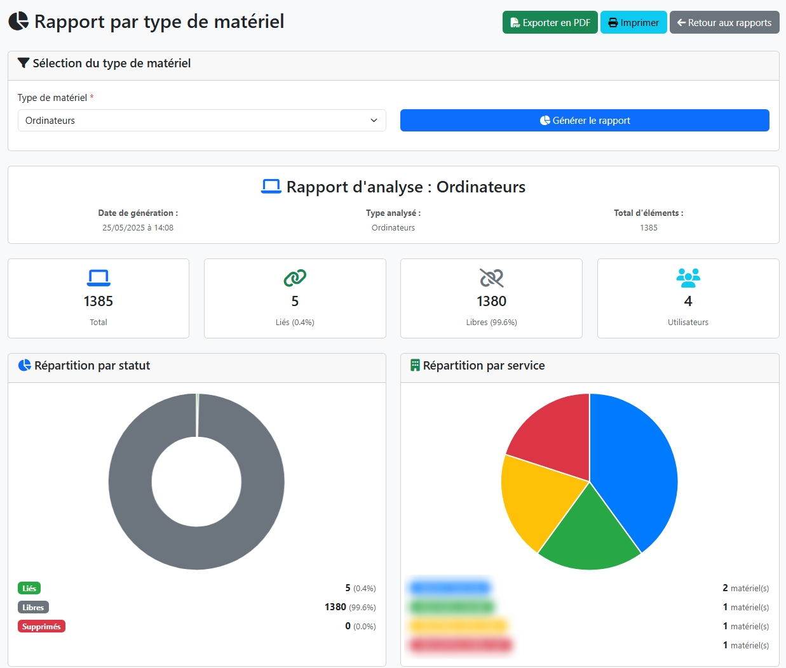

# userslinker


A small gesture, a big support! Buy me a coffee ☕ if you appreciate my work. Thanks in advance!

[](https://www.buymeacoffee.com/yann83)


## About

This application manages the movement of equipment loaned to your employees, allowing you to keep track of incoming and outgoing items. The application is easy to use, and three roles are used to separate each person's responsibilities. This application is very useful if you have remote workers in your company; you'll have access to lists and reports of your assets' movements.

## Installation

> git clone https://github.com/yann83/MapProject.git


In `setup` folder change this values

```
MYSQL_HOST=localhost
MYSQL_USER=root
MYSQL_PASSWORD=your_password_here
MYSQL_DB=bd_userslinker
```

Then run

> python setup.py

## How to use


I recommend clearly separating roles; an administrator should not be a manager.

### Administrator Role



Administrators can:

- Create, modify, and delete users for application access
- Import data from other databases



To connect to another database, you must create a `bdd.json` file in the `config` folder.

Here is an example :

```json
{
"users":{
	"connect":{
		"host":"localhost",
		"user":"root",
		"password":"",
		"db":"users",
		"table":"all_users"
		},
	"fields":{
		"GivenName":"givenName",
		"Surname":"surname",
		"Username":"login",
		"email":"mail",
		"Title":"title",
		"Department":"service",
		"Site":"location"
		}
	},
"computers":{
	"connect":{
		"host":"localhost",
		"user":"root",
		"password":"",
		"db":"glpi",
		"table":"glpi_computers"
		},
	"fields":{
		"name":"name",
		"serial":"serial",
		"otherserial":"otherserial"
		}
	},
"monitors":{
	"connect":{
		"host":"localhost",
		"user":"root",
		"password":"",
		"db":"glpi",
		"table":"glpi_monitors"
		},
	"fields":{
		"name":"name",
		"serial":"serial",
		"otherserial":"otherserial"
		}
	},
"peripherals":{
	"connect":{
		"host":"localhost",
		"user":"root",
		"password":"",
		"db":"glpi",
		"table":"glpi_peripherals"
		},
	"fields":{
		"name":"name",
		"serial":"serial",
		"otherserial":"otherserial"
		}
	},
"phones":{
	"connect":{
		"host":"localhost",
		"user":"root",
		"password":"",
		"db":"glpi",
		"table":"glpi_phones"
		},
	"fields":{
		"name":"name",
		"serial":"serial",
		"otherserial":"otherserial"
		}
	}	
}
```

You can create a post process of the import by creating sql queries in the `post.sql` file in the `config` folder, for example:

```sql
DELETE FROM bd_userslinker.phones
WHERE (name IS NULL OR name = '')
  OR (otherserial IS NULL OR otherserial = '');
```

### Manager Role


The manager can access the following functions:

- Create an event: manage links between users and equipment
- Lists: view users and equipment
- Reports: generate reports and statistics

__Create an event__



This is the most important function. You must follow the steps to assign (link) or retrieve (unlink) equipment for a given user.

__Lists__


Allows you to view the equipment inventory and create, edit, or delete objects.

__Reports__


1. Report by department: Generates a detailed report of users and their equipment by department.

- Filter by department (required)
- Filter by period (optional)
- Display of linked equipment
- History of movements

2. Report by user: Generates a detailed report for a specific user.

- Dynamic user search
- Complete history (all dates)
- Currently linked equipment
- Detailed statistics

3. Report by equipment type: Analysis of distribution and usage by equipment type.



- Pie charts
- Detailed statistics
- Utilization rates
- Breakdown by department

4. Activity report: analysis of movements and activities over a given period.

- Activity timeline
- Statistics by manager
- Trend charts
- Detailed export

### Reader role

The reader can access the following functions:

- Lists: view users and equipment.
- Reports: generate reports and statistics.

The reader does not have editing rights to lists.
